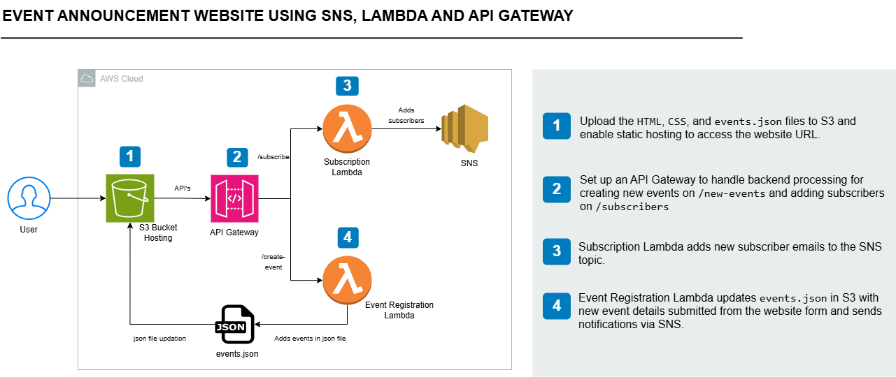
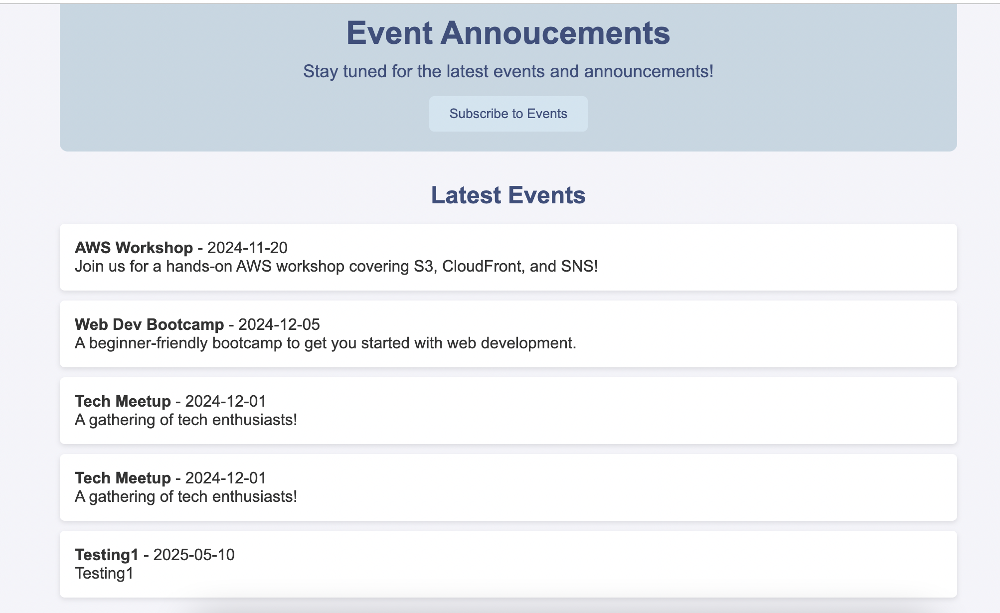

# Event Announcement System

### Overview
This project is an example built alongside an AWS Tutorial from Tech With Lucy.
The event announcement website that allows users to do the following:

1. Subscribe to event notifications via email.
2. View a list of events.
3. Create new events through a form.

## AWS Services used

AWS S3: Host the frontend and store event data in a JSON file.  
AWS SNS: Manage email subscriptions and send event notifications.  
AWS Lambda: Handle backend logic for creating events and managing subscriptions.  
AWS API Gateway: Provide endpoints for frontend to communicate with backend services.  
IAM Roles & Policies: Secure access to AWS resources like S3 and SNS.  

## Project Architecture

## Implementation Details:
1. **Website Hosting**  
   **Technology:** S3 with static hosting
   **Details:** The website is hosted in an S3 bucket using html, css and json file to store the events. 

2. **Backend Processing**  
   **Technology:** REST API Gateway, Lambda
   **Details:**
    - API Gateway triggers the Lambda functions. It has 2 endpoints, one for adding subscribers to events and the other for creating new events.  
    - Two Lambda functions, one to handle subscription to events and the other to enable creation of new events.
    
 
